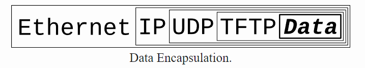

# HTTP Server using c++
---
## For Windows Systems
# HTTP Server using C++

---

## Table of Contents
- [Introduction](#introduction)
- [Prerequisites](#prerequisites)
- [Setting Up the Environment](#setting-up-the-environment)
- [Installing Dependencies](#installing-dependencies)
- [Creating the HTTP Server](#creating-the-http-server)
- [Testing the Server](#testing-the-server)
- [Troubleshooting](#troubleshooting)
- [Conclusion](#conclusion)

---

## Introduction
This Project is based on creating a "http server using c++ on windows systems" and also a beginner documentations to Socket Programming.The contents are created as a parallelism to unix systems to get a holistic view over socket.

## Prerequisites
Some Prerequisites to understand websocket programming.
Lets start with why are we even learning socket programming and what is socket and why we need it?

What is socket?
There are programs in a computer running and they depend on each other to get the task done for task like facilitating communication and 
coordination between separate processes.This processes are called InterProcessCommunication and to ensure that they talk with each other we use sockets which are basically "pipes which can send and recieve data" or say "a way to speak to other programs using standard Unix file descriptors" for unix systems and for windows we use handles and the underlying structure is different from unix systems.

File descriptors?  
They are like an integer associated with any unix files, yes everything in unix is a file or so.The file descriptor for network communication can be found using the system routine socket().
## For Unix Systems  
For Internet Sockets we have two sockets,  
1.Stream socket  (SOCK_STREAM)  
2.DataGram socket (SOCK_DGRAM)  
## For Windows System  
1.Winsock  
When we put 1,2 as input in one end of the pipe we get 1,2 in same orderly fashion.How do stream socket are so reliable in data transmission quality.  
You may have heard the famous protocol pair of TCP/IP which most of the internet uses.Guess what,The protocol of stream socket is TCP/IP.  

Who uses DGRAM?  
Well some file transfer protocols like ftp,tftp,dhcpcd,games,streaming audio,video conferencing.  
Well tftp gets some data packets(You probably already know how data is divided into smaller parts) from Datagram socket and then they send an ACK(Acknowledgement) and if socket doesn't recieve a ACK within a time limit, they send back the same data packet until they recieve ACK.
___
Also whats the use of dgram?  
Well for a faster transmission unlike stream socket when we need a open connected path to send data, you only need to provide ip address to a data packets and hopefully they reach it and also known as connectionless.  

For Example, when we play multiplayer video games, the positional updates each second done is using dgram because losing a bit of packets here and there isn't a big deal.This is what we call as lag.  

This data is encapsulated and When another computer receives the packet, the hardware strips the Ethernet header, the kernel strips the IP and UDP headers, the TFTP program strips the TFTP header, and it finally has the data.  

The OSI model takes cares how data is send without us caring about lower level implementations:
-Application Layer  
-Presentation Layer  
-Session Layer  
-Transport Layer  
-Network Layer  
-Data Link Layer  
-Physical Layer  

For a more unix like environment, we have  
Application Layer (telnet,ftp,etc)  
Host to Host Transport Layer (TCP,UDP)  
Internet Layer (IP and routing)  
Network Access Layer (Ethernet,wifi etc)  

The kernel builds the Transport Layer and Internet Layer on for you and the hardware does the Network Access Layer.  

## Setting Up the Environment
Detailed instructions on setting up the development environment.

## Installing Dependencies
Steps to install any required libraries or frameworks.

## Creating the HTTP Server
Server Side:  
1.Create a socket  
2.Bind it to a port(Here Port is fixed and also manual)  
3.Listen to new connection  
4.If a new Connection is present,Bind yourself to same IP,Port and create a new socket and connect to the client so that the previous socket could still be listening to new connections  
5.send and recieve data using recv(),send(),sendto(),recvfrom()  
6.Once every is done, we close the server by giving EOF(End of File) or closeSocket()  

Client Side:  
1.Create a Socket  
2.Connect to server  
3.send and recieve data using recv(),send(),sendto(),recvfrom()  
4.Once every is done, we close the server by giving EOF(End of File) or closeSocket()  

The Server code:  
1.The Server must load the Dll by invoking WSAStartup.  
Dll stands for Dynamic link loader.Its kind of a file format like .txt or .jpeg  
An image.jpeg is usually where image is a file structure and its data is organized in such a way that its encoded,store and interpreted by a special/dedicated application like photos app in microsoft.  

Why we need dll ?  
Task's like memory management etc which are used again and again by programs are compiled inside a file format like dll to ensure a faster retrieval/call of basic repetitive work.  

Two Programs or more can access the executable files present in dll.  

## Testing the Server
Guidance on testing the server to ensure it works as expected.

## Troubleshooting
Common problems encountered during setup and how to resolve them.

## Conclusion
Wrap up the guide and provide any final notes or recommendations.
